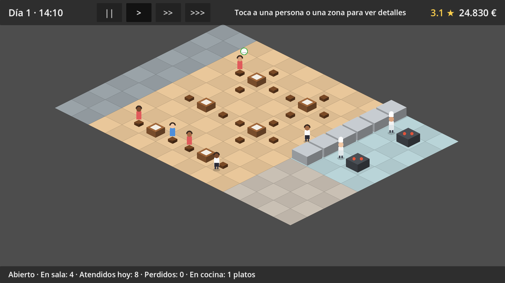

# Gestión Restaurante

Juego de gestión de restaurantes para móvil (Android e iOS), hecho con **Godot 4.5**.

- Diseño del juego: [`docs/GDD.md`](docs/GDD.md)
- Proyecto de Godot: carpeta [`game/`](game/)

## Cómo abrirlo

1. Descarga [Godot 4.5](https://godotengine.org/download) (versión estándar, no .NET).
2. En el gestor de proyectos: **Importar** → selecciona `game/project.godot`.
3. Pulsa **F5** para jugar.

Controles provisionales: arrastrar para mover la cámara, rueda/pellizco para zoom,
tocar una persona o una baldosa para ver detalles, barra espaciadora para pausar.



## Pruebas

```bash
godot --headless --path game -s res://tests/run_tests.gd
```

## Estructura

```
game/
  simulation/  lógica pura del juego (reloj, economía, cocina...)
  data/        contenido en JSON (ingredientes, recetas...)
  scenes/      mundo isométrico y personajes
  ui/          interfaz
  tests/       pruebas automáticas
docs/          documento de diseño
```
